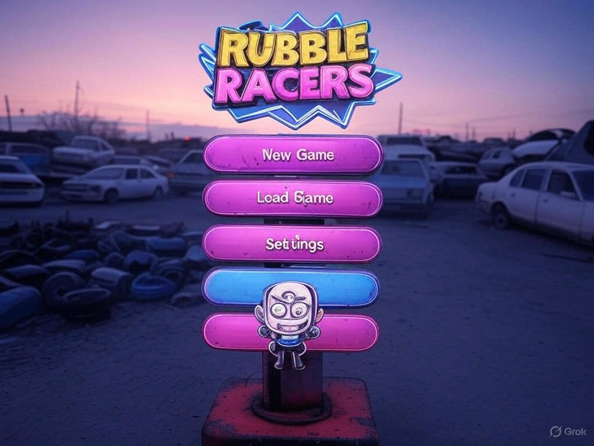
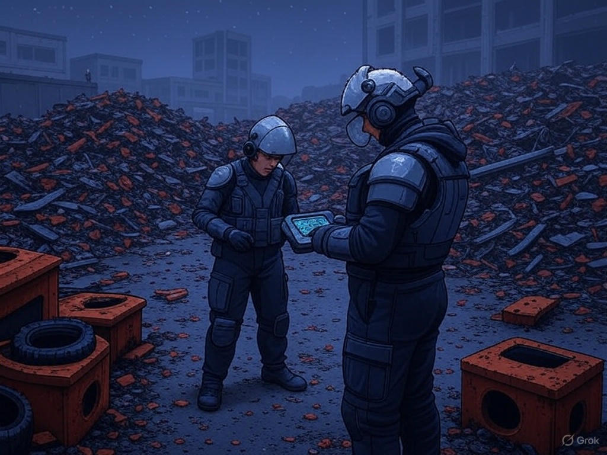
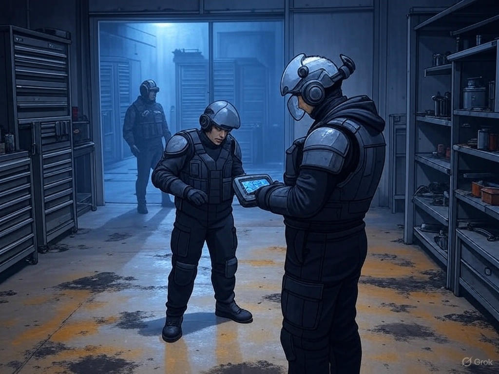
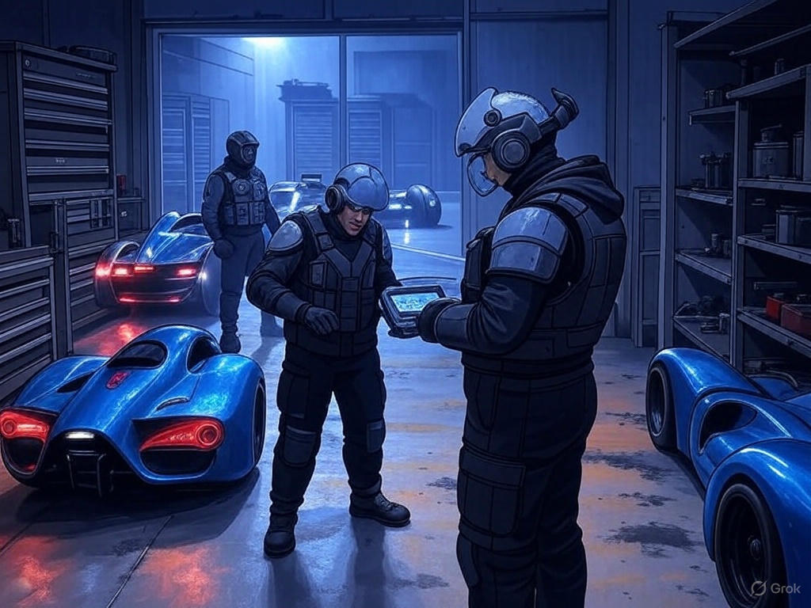

# Rubble Racers - Design Spec

## Overview

In **Rubble Racers**, players must **scavenge, build, and race** their way through a post-apocalyptic world. Starting with a bare-bones junk car in a gritty 3D junkyard home base, players explore their surroundings to find parts, complete mini-games to earn rare components, and build custom vehicles to race on dangerous tracks. Each level pits the player against a new rival racer. Winning races earns cash and respect, bringing them one step closer to facing the mysterious **final boss racer**. Every decision, part, and upgrade affects performance — and looks.

---

## 1. Problem Definition and User Research (25 points)

### Problem Addressed

Many racing games offer fast action but lack deep customization and narrative progression. Rubble Racers fills that gap by combining:
- Car-building mechanics
- Exploration
- Progression toward a final boss
- A gritty, immersive setting

### Target Audience

- **Age Group**: 13+
- **Core Audience**: PC gamers who enjoy racing, light RPG elements, and crafting/building mechanics.
- **Interest Areas**: Customization, post-apocalyptic themes, vehicle simulation, resource management, and solo adventure games.

### User Personas

**Jake, 15 – "The Builder"**  
Loves customizing vehicles and discovering optimal builds. Spends time in the junkyard carefully assembling his next ride.

**Ava, 17 – "The Explorer"**  
Loves immersive environments and scavenging. She roams the junkyard, enjoying the thrill of discovering rare parts through mini-games.

---

## 2. Conceptualization and Design (30 points)

### Core Features

1. **3D Junkyard Home Base**  
   - Fully explorable in third-person  
   - Randomly spawning parts  
   - Hidden areas with rare items  
   - Mini-games for unlocking rare components (welding, circuit repair, balance challenges)  

   

2. **Garage / Workshop Interface**
   - Drag-and-drop car building  
   - Modular parts: chassis, engine, tires, armor, boosters, gadgets  
   - Each part affects stats (speed, handling, durability, acceleration)  

   

3. **Shop System**
   - Spend race winnings to buy parts  
   - Parts have rarity and performance ratings  
   - Optional cosmetic upgrades (paint, decals, rust polish)  

4. **Race Mode**
   - First- or third-person racing  
   - Unique opponents per level  
   - Procedurally generated terrain obstacles  
   - Destructible environments and dynamic weather  

   

5. **Progression System**
   - Race through 10 stages  
   - Each stage features a tougher opponent and track complexity  
   - Final boss unlocks only with a car above a certain rating

---

### User Flow

1. **Start Screen**
   - New game, load game, settings  
   - Choose name and customize character

2. **Home Base (Junkyard)**
   - Roam freely in 3D  
   - Collect parts  
   - Access workshop to build car  
   - Talk to NPCs who offer side quests or tips

3. **Workshop**
   - Equip parts  
   - View car stats and design  
   - Save builds

4. **Race Selection Menu**
   - Choose current unlocked level  
   - View rival racer profile and track info

5. **Race Gameplay**
   - 1v1 races  
   - Victory = cash + upgrade unlocks  
   - Optional replay system and photo mode

---

## 3. Behaviors (15 points)

### What Makes It Engaging

- **Personalization**: Cars look and feel unique. The visual model updates dynamically with part changes.  
- **Exploration**: Searching the junkyard feels like a mini open-world game.  
- **Progression Loop**: Find parts → build car → race → earn rewards → repeat  
- **Challenge Variety**: Mini-games offer skill-based interactions outside of racing.  
- **Narrative Mystery**: Who is the final boss? Why are they unbeatable?

---

## 4. Deployment and Maintenance (10 points)

### Deployment

- Initial release target: **PC** (Windows)  
- Game engine: **Unity 3D** or **Unreal Engine 5**  
- Distribution: **Steam** or **itch.io**

### Maintenance and Updates

- Planned Updates:  
  - New parts & customization options  
  - Additional race tracks and challenges  
  - Side quests and junkyard expansions  
- Bug fixes and performance optimizations via patch system  
- Community feedback integration via GitHub Issues or Steam forums

---

Rubble Racers is about **earning your ride**, **facing off against impossible odds**, and **leaving your mark** on the wasteland. A single-player, skill-driven journey from junk to juggernaut.
